# Compactage extractif générique — Live Memory 2.8.0

**Statut : gate représentatif Map/Reduce franchi — NO-GO produit avant les répétitions de recette et la release review**

## Décision

Le compacteur ne connaît aucun nom ni rôle de fichier. Il travaille sur
l'inventaire logique canonique de la Memory Bank déjà construit par le serveur.
Chaque fichier Markdown logique qui dépasse `BANK_FILE_MAX_SIZE` est analysé à
partir de sa structure et de son contenu.

Qwen 35B produit des fiches temporaires puis classe des IDs d'unités Markdown
complètes ; aucune prose générée n'est persistée. Le serveur conserve les unités
retenues dans leurs octets source exacts et supprime les autres. La fidélité
recherchée est donc la préservation du sens global et des points importants, pas
l'exhaustivité de l'historique ni de ses répétitions.

Les noms tels que `progress.md` ou `systemPatterns.md` n'apparaissent que dans
les fixtures de recette. Ils ne déclenchent aucun comportement particulier.

## Algorithme unique

```mermaid
flowchart TD
    subgraph P1["1. Inventaire et préflight déterministes"]
        Q0["Job FIFO par space<br/>verrou de consolidation exclusif"]
        A["Inventaire logique canonique<br/>familles legacy réassemblées en mémoire"]
        B{"Famille legacy cohérente ?"}
        B1{"Classement du fichier logique"}
        B2["Sous limite, canonique<br/>aucune action"]
        B3["Sous limite, legacy<br/>réassemblage exact, 0 LLM"]
        C["Décodage UTF-8 strict<br/>parse Markdown unique"]
        D["Offsets de lignes convertis<br/>en offsets d'octets source"]
        E{"Au moins 2 unités datées<br/>de même nature ?"}
        F["Mode daté<br/>H3 datés prioritaires, sinon items datés"]
        G["Mode sections<br/>H3 complets"]
        H["U = unités candidates exactes<br/>P = unités protégées/contextuelles"]
        I["Base = source moins toutes les U<br/>disponible = limite moins taille(base)"]
        J{"Base sous la limite<br/>et U non vide ?"}
        K["Budget daté = 75 % du disponible<br/>Budget sections = 100 %"]
        L["Maps gloutonnes en ordre source<br/>≤ 32 unités et ≤ 40 000 octets"]
        M["Préflight de tous les prompts<br/>et du pire Reduce avant le 1er appel"]
    end

    subgraph P2["2. Sélection sémantique éphémère"]
        N["Map Qwen par lot<br/>ID | fiche ≤ 240 octets"]
        O{"Map terminée avec stop<br/>et au moins une fiche valide ?"}
        P["Fallback code-owned pour omissions<br/>première ligne source bornée"]
        Q["Reduce unique du fichier<br/>rôle | ID | date | taille | fiche"]
        R{"Au moins un ID U connu<br/>et finish_reason = stop ?"}
        S["Classement dédupliqué<br/>IDs inconnus ignorés"]
        T["Sélection gloutonne sous budget<br/>saut des unités qui ne tiennent pas"]
    end

    subgraph P3["3. Construction source-only"]
        U["Remettre les unités retenues<br/>dans l'ordre documentaire"]
        V["Supprimer les autres U<br/>par offsets décroissants"]
        W{"Offsets/source exacts,<br/>candidat plus petit et sous limite ?"}
        X["Conserver tous les candidats<br/>en mémoire, aucune écriture"]
    end

    subgraph P4["4. Transaction S3"]
        Y["Backup global restorable"]
        Y1{"Backup créé sans erreur ?"}
        Z["Écriture canonique fichier par fichier"]
        AA["Relecture exacte et suppression<br/>des anciennes parts legacy"]
        AB{"Toutes les écritures<br/>et vérifications réussies ?"}
        AC["Succès + rapport hashes,<br/>tailles, appels et sélection"]
        AD["Rollback global de bank/<br/>puis vérification contenu + keyset"]
    end

    FAIL["FAIL CLOSED<br/>0 appel si préflight ; sinon 0 backup/écriture<br/>tant que les candidats ne sont pas tous valides"]
    BLOCK["Compaction bloquante :<br/>la consolidation ne consomme aucune note"]

    Q0 --> A --> B
    B -- "non" --> FAIL
    B -- "oui" --> B1
    B1 -- "canonique sous limite" --> B2 --> AC
    B1 -- "legacy sous limite" --> B3 --> X
    B1 -- "au-dessus de la limite" --> C --> D --> E
    E -- "oui" --> F --> H
    E -- "non" --> G --> H
    H --> I --> J
    J -- "non" --> FAIL
    J -- "oui" --> K --> L --> M --> N
    N --> O
    O -- "non" --> FAIL
    O -- "oui" --> P --> Q --> R
    R -- "non" --> FAIL
    R -- "oui" --> S --> T --> U --> V --> W
    W -- "non" --> FAIL
    W -- "oui" --> X
    X -- "tous les fichiers prêts" --> Y --> Y1
    Y1 -- "non" --> FAIL
    Y1 -- "oui" --> Z --> AA --> AB
    AB -- "oui" --> AC
    AB -- "non" --> AD --> BLOCK
    FAIL --> BLOCK
```

### 1. Inventaire

- Le serveur utilise uniquement les fichiers logiques issus de son inventaire
  canonique, y compris les familles legacy réassemblées en mémoire.
- Le serveur liste les objets de `bank/`, réassemble l'inventaire logique
  canonique, puis découvre les candidats uniquement dans ces fichiers logiques ;
  une part legacy isolée n'est jamais analysée comme un document autonome.
- Les limites et tailles sont mesurées en octets UTF-8.
- `markdown-it-py` fournit l'unique vue Markdown.

### 2. Détection du mode

Le mode est déterminé indépendamment pour chaque fichier surdimensionné :

- **Mode daté** : le fichier contient au moins deux unités structurelles de même
  nature dont le label porte une date complète ISO ou `jj/mm/aaaa`. Les dates
  citées dans le corps ne comptent pas. Les H3 datés sont prioritaires ; à
  défaut, les items de liste de premier niveau datés sont utilisés, y compris
  sous un H3 conteneur non daté. Les deux représentations ne sont jamais
  mélangées. Seules les unités antérieures au dernier jour sont candidates ; le
  dernier jour et les unités non datées restent protégés.
- **Mode sections** : en l'absence de journal daté identifiable, les sections H3
  complètes sont candidates. Une section va de son H3 au prochain H1, H2 ou H3.
- **Échec fermé** : sans journal daté identifiable ni section H3 complète, le
  fichier n'est pas compactable et le job entier s'arrête avant tout appel LLM.

Le seuil de deux dates évite qu'une date incidente transforme un document
thématique en journal. Une fois le mode daté choisi, le compacteur ne réutilise
pas les H3 non datés comme candidats dans le même job.

### 3. Contenu protégé

Une unité contenant une fence, un bloc de code indenté ou du HTML brut/inline
est entièrement protégée. Le préambule, les séparateurs, le contenu récent ou
non daté et toutes les zones extérieures aux unités candidates restent
byte-identiques.

Les Maps d'un fichier incluent ses unités candidates et protégées. Le Reduce
reçoit leurs fiches bornées, avec un rôle `selectable` ou `protected`. Aucun
autre fichier n'est utilisé comme autorité : le résultat d'un fichier doit être
défendable par son contenu seul.

### 4. Classement et rendu

- Les unités complètes sont regroupées dans des Maps de 40 000 octets et 32
  unités maximum. Une unité dépassant seule cette borne fait échouer le
  préflight.
- Chaque Map retourne une fiche temporaire de 240 octets maximum par unité. Une
  omission reçoit uniquement la première ligne source comme fallback. Les
  fiches ne sont jamais journalisées, rapportées ou persistées.
- Un Reduce unique par fichier reçoit seulement `rôle | ID | date | octets |
  fiche`. La date reste secondaire : une résolution explicite prime sur un état
  intermédiaire plus récent. Il retourne le sous-ensemble ordonné des IDs à
  retenir et peut laisser du budget inutilisé.
- Les IDs inconnus et doublons sont ignorés, mais au moins un ID connu tenant
  dans le budget est obligatoire. Les IDs omis ne sont pas ajoutés en queue.
- Le code retient gloutonnement des unités entières jusqu'au budget disponible,
  puis les rend dans leur ordre documentaire en supprimant seulement les unités
  anciennes non retenues.
- En mode daté, 75 % de la place restant après le contenu protégé est allouée aux
  unités anciennes afin de conserver une marge de croissance. En mode sections,
  toute la place disponible est utilisable.
- Le candidat doit être strictement plus petit que l'original et ne pas dépasser
  `BANK_FILE_MAX_SIZE`.

Il n'existe ni résumé génératif persisté, ni reconstruction de headings, ni
éditeur Markdown, ni second algorithme.

## Spécification complète de l'algorithme

Cette section est normative. Elle décrit le chemin réellement implémenté, sans
raccourci lié aux fixtures.

### A. Entrée, unités et offsets

1. Construire l'inventaire des fichiers logiques. Une famille legacy
   `*.part-NNN.md` cohérente est réassemblée en mémoire ; une famille incomplète
   ou contradictoire arrête le job.
2. Pour chaque fichier au-dessus de sa limite universelle, encoder son contenu
   canonique en UTF-8 puis le décoder strictement. Il n'y a ni normalisation des
   fins de ligne, ni suppression de BOM, ni conversion CRLF/LF.
3. Parser le Markdown avec `markdown-it-py`. Convertir les positions de lignes
   du parseur en offsets d'octets UTF-8 dans le buffer original.
4. Construire des unités indivisibles :
   - une section H3 commence au heading et finit au prochain H1, H2 ou H3 ;
   - un item daté est un item de liste de premier niveau avec son contenu ;
   - un item de liste inclus dans une section H3 n'est jamais sélectionné une
     seconde fois.
5. Détecter les dates uniquement dans le label structurel avec une date ISO
   `aaaa-mm-jj` ou française `jj/mm/aaaa` complète. Une date citée dans le corps
   ne change jamais le mode.
6. Refuser tout chevauchement. Pour chaque unité, vérifier que
   `source[start_byte:end_byte]` correspond exactement aux octets mémorisés.

### B. Candidats et protections

1. Si au moins deux H3 sont datés, choisir leurs sections comme unités du mode
   daté. Sinon, si au moins deux items de premier niveau sont datés, choisir ces
   items. Les deux représentations ne sont jamais mélangées.
2. En mode daté, rendre sélectionnables uniquement les unités datées antérieures
   au dernier jour observé. Le dernier jour, les unités sans date et les unités
   contenant `fence`, `code_block`, `html_block` ou `html_inline` sont
   protégés.
3. Si aucun mode daté n'est établi, utiliser les H3 complets sûrs en mode
   sections. Sans H3 complet, refuser le fichier.
4. Calculer `base` en supprimant temporairement toutes les unités candidates de
   la source. Tout ce qui n'est pas candidat appartient donc mécaniquement à la
   base immuable.
5. Calculer `available = BANK_FILE_MAX_SIZE - bytes(base)`. Si `available <= 0`,
   la compaction est impossible. Allouer `floor(available × 3/4)` aux anciennes
   unités en mode daté, et `available` en mode sections.

### C. Préflight global

1. Trier candidats et contexte protégé par offset source, puis créer des lots
   gloutons de 32 unités et 40 000 octets source maximum. Une unité indivisible
   de plus de 40 000 octets arrête le job.
2. Construire tous les prompts Map. Construire aussi un Reduce de pire cas avec
   une fiche de 240 octets pour chaque unité.
3. Avant le premier appel, vérifier pour chaque prompt que sa taille plus le
   plafond de sortie tient dans la fenêtre configurée. Vérifier aussi que la
   configuration autorise au moins 4 000 tokens de sortie Map.
4. Calculer exactement `planned_llm_calls = nombre_de_Maps + 1 Reduce` par
   fichier. Si un seul fichier échoue au préflight, rapporter zéro appel planifié
   et n'appeler Qwen pour aucun fichier.

### D. Maps et fiches temporaires

1. Envoyer à Qwen chaque lot source exact entre marqueurs de données non fiables,
   avec température zéro, thinking désactivé et plafond de 4 000 tokens.
2. Exiger `finish_reason=stop`. Il n'existe aucun retry.
3. Lire la sortie ligne par ligne. Une ligne est valide si elle contient un seul
   ID connu ; plusieurs répétitions de ce même ID sont tolérées, deux IDs
   distincts rendent la ligne ambiguë et elle est ignorée. La première fiche
   valide d'un ID gagne.
4. Normaliser les espaces de la fiche et la borner à 240 octets UTF-8. Les IDs
   inconnus, lignes ambiguës et doublons sont ignorés.
5. Si une Map ne fournit aucune fiche valide, arrêter le job. Pour chaque unité
   omise dans une Map autrement valide, fabriquer une fiche code-owned depuis sa
   première ligne source non vide, avec la même borne de 240 octets.
6. Les fiches restent uniquement en mémoire : ni Bank, ni rapport, ni log ne
   contient leur texte.

### E. Reduce et sélection sous budget

1. Appeler exactement un Reduce par fichier, avec un plafond de 2 000 tokens.
   Il reçoit toutes les fiches et uniquement les métadonnées code-owned : rôle
   `selectable` ou `protected`, ID, date, taille source et fiche.
2. En mode daté, demander de privilégier les résolutions et états finaux, les
   expositions de sécurité, les blocages ouverts, les actions correctives,
   décisions, incidents et jalons ; pénaliser les répétitions et états
   remplacés. En mode sections, privilégier mécanismes, invariants, décisions
   d'architecture et risques durables.
3. Les unités protégées donnent le contexte nécessaire pour identifier un état
   remplacé, mais leurs IDs sont interdits dans le classement retourné.
4. Parser les IDs candidats connus dans leur ordre de sortie, dédupliquer et
   ignorer les inconnus. Une sortie sans ID connu ou non terminée par
   `finish_reason=stop` arrête le job. Les candidats omis ne sont pas rajoutés.
5. Parcourir le classement une fois. Retenir une unité entière si elle tient
   dans le budget restant ; sinon la sauter et continuer. Il n'y a ni knapsack,
   ni score, ni seconde passe. Au moins une unité doit tenir.
6. Trier finalement les unités retenues par offset documentaire : le LLM choisit
   l'importance, jamais l'ordre du Markdown persisté.

### F. Construction, validation et persistance

1. Partir des octets originaux. Supprimer, en offsets décroissants, chaque unité
   candidate non retenue. Avant chaque suppression, revérifier offsets et octets
   source. Les unités retenues, la base et les zones protégées ne sont jamais
   réécrites.
2. Exiger un candidat strictement plus petit et inférieur ou égal à la limite
   configurée. Préparer et valider ainsi tous les fichiers en mémoire.
3. Créer ensuite un backup standard de tout le space. Une défaillance du backup
   produit zéro écriture.
4. Écrire chaque cible sous son nom canonique, la relire exactement, puis
   supprimer ses anciennes parts legacy. Une famille legacy sous la limite est
   seulement réassemblée, sans appel LLM.
5. Au premier échec de persistance, restaurer globalement `bank/` depuis le
   backup et vérifier à la fois chaque contenu et l'ensemble des clés. Ne jamais
   restaurer le space entier : une note live créée concurremment ne doit pas être
   supprimée.
6. Un échec de compaction automatique est bloquant pour la consolidation qui
   suit ; aucune note live n'est consommée contre une Bank non maîtrisée.

### G. Sorties observables

Le rapport expose seulement les faits nécessaires à l'exploitation : modèle,
`finish_reason`, appels planifiés/tentés, lots Map, nombres de fiches valides et
fallbacks, mode, unités candidates/protégées/retenues, budget et octets retenus,
tailles et SHA-256 avant/après, cible atteinte et identifiant du backup. Les
prompts, fiches et sorties brutes du LLM restent éphémères.

Le `dry_run` inventorie les fichiers, les tailles, les familles legacy et le
nombre d'appels prévu. Il n'appelle jamais le LLM, ne crée pas de backup et
n'écrit rien.

### H. Invocation et concurrence

- L'opération exige l'accès au space et la permission `manage`.
- `dry_run=true` exécute uniquement l'inventaire et estime le nombre d'appels à
  partir des lots ; il ne réalise pas le préflight complet des budgets et
  prompts.
- `dry_run=false` ne compacte pas dans la requête MCP : il place un job dans la
  FIFO existante du space et retourne immédiatement son `job_id`.
- Le worker exécute compaction et consolidation sous le même verrou exclusif par
  space. Il ne peut donc pas lancer deux mutations de Bank concurrentes dans le
  même processus.

## Transaction et coupe-circuit

L'ordre est obligatoire :

1. inventorier tous les fichiers logiques ;
2. préflighter tous les fichiers surdimensionnés, leurs budgets, prompts et
   fenêtres de contexte avant le premier appel Qwen ;
3. obtenir toutes les fiches Map puis un Reduce par fichier ;
4. construire et valider tous les candidats en mémoire ;
5. créer le backup global ;
6. écrire, relire et vérifier les fichiers canoniques ;
7. restaurer et vérifier tout `bank/` au moindre échec de persistance.

Un échec de préflight, de classement ou de candidat produit zéro backup et zéro
écriture. Un échec d'auto-compaction bloque la consolidation suivante : aucune
note live n'est consommée. Les mécanismes éprouvés de la 2.7.3 restent les seuls
mécanismes de persistance : backup, rollback, écriture canonique et FIFO par
espace.

Après un préflight réussi, les rapports exposent `planned_llm_calls`, égal au
nombre exact de Maps plus un Reduce par fichier compressible. Ils exposent aussi
les compteurs de fiches valides et de fallbacks, jamais leur contenu. Un
préflight rejeté rapporte zéro appel planifié et provoque effectivement zéro
appel. Une famille legacy déjà sous la limite est réassemblée byte-exactement
sans appel Qwen.

## Contrat LLM

- modèle configuré, qualifié avec `qwen3.6:35b` ;
- température zéro et thinking désactivé ;
- maximum 4 000 tokens par Map et 2 000 tokens pour le Reduce ;
- sorties utilisées uniquement comme fiches temporaires puis classement d'IDs ;
- contexte limité au fichier traité ;
- aucun retry, modèle secondaire, JSON d'édition ou prose persistée.

## Gates de validation

Le changement d'une architecture liée à trois noms de fichiers vers ce contrat
générique invalide le précédent gate produit. La branche et sa Draft PR servent
de véhicule de revue. Le run représentatif unique décrit plus bas autorise la
poursuite des gates, mais pas le merge, le bump ou la release. Avant ceux-ci, il
faut :

1. une suite unitaire complète verte, avec notamment le même contenu sous deux
   noms arbitraires produisant le même plan ;
2. trois restaurations et exécutions Docker consécutives sur la fixture réelle
   `mcp-agent` ;
3. trois restaurations et exécutions Docker consécutives sur la fixture réelle
   `agentic-platform`, représentative des gros fichiers ;
4. pour chaque passe : taille finale conforme, contenu protégé et extérieur
   byte-identique, aucun fichier en échec, backup avant écriture et rollback
   vérifié par mutation ;
5. revue humaine du sens global et des points importants conservés ;
6. revue adverse indépendante favorable.

Les résultats obtenus avec l'ancienne sélection par noms restent une preuve
historique de faisabilité extractive et transactionnelle, mais ne valident pas
ce contrat générique. La production et l'auto-compaction restent gelées jusqu'au
canari manuel convenu.

### Recette générique du 15 août 2026 — NO-GO

Un backup frais du space distant `agentic-platform` a été restauré byte-exactement
dans le bucket DEV utilisé par le Docker local. Le run réel
`compact_14bda21a71e041d884770ee47dbd5efd` a traité le seul fichier
surdimensionné avec le vrai `qwen3.6:35b` :

- `progress.md` : 195 489 → 26 906 octets, sous la limite de 35 000 ;
- un appel Qwen, `finish_reason=stop`, aucun retry ;
- 170 unités éligibles, 21 retenues, 3 protégées ;
- 6/6 autres fichiers byte-identiques ;
- candidat indépendamment reconstruit par suppression d'unités entières
  uniquement ; contenu protégé exact ;
- backup transactionnel créé avant l'écriture.

Le gate humain est toutefois rouge. Dix-sept des 21 unités retenues, soit
81,6 % des octets sélectionnés, décrivent une même chaîne de canaris des 3 au
6 août. Des résolutions et faits plus récents disparaissent, notamment le
vecteur d'exposition de `BROKER_SIGNING_ENC_KEY` via `show-mcp-env.py` et la fin
de migration, tandis que plusieurs blocages intermédiaires déjà résolus restent
surreprésentés.

Conclusion : cette recette valide l'intégrité, le coût et la transaction, mais
invalide le classement global direct comme arbitre de la valeur future sur un
gros journal. Cet algorithme direct ne doit pas être rejoué. Le candidat
hiérarchique Map/Reduce qui le remplace doit subir une nouvelle recette
`agentic-platform` et une revue humaine avant tout autre gate. Aucun merge,
bump, release, canari ou déploiement production n'est autorisé jusque-là.

### Premier gate Map/Reduce — rejet protocolaire sans écriture

Le job `compact_e2216dc065ae480eb681d2b6c21799be` a préflighté sept appels,
puis s'est arrêté au premier Map avec `Qwen returned no valid unit card` : une
tentative, zéro backup, zéro écriture et les 259 051 octets source inchangés.

Un probe isolé du même premier Map, hors S3 et sans retry, a montré 32 lignes
sur 32 avec le même ID répété dans sa propre fiche, sans aucun ID distinct ou
inconnu. Cette répétition n'est pas ambiguë. Le parseur accepte donc plusieurs
occurrences d'un même ID connu et les retire toutes de la fiche ; il rejette
toujours toute ligne portant deux IDs distincts. La recette suivante valide ce
contrat corrigé.

### Second gate Map/Reduce — GO mécanique et métier

Après restauration byte-exacte de la même source, le job autorisé
`compact_4bc139a462d44457b930c02186a8f782` a terminé en environ 131 secondes :

- `progress.md` : 195 489 → 27 072 octets (-86,2 %), sous la limite ;
- sept appels planifiés et tentés : six Maps et un Reduce, sans retry ;
- 173 fiches valides, aucun fallback et aucun fichier en échec ;
- 170 unités anciennes éligibles, 18 retenues pour 23 679 octets sur un budget
  de 23 705, plus trois unités protégées ;
- backup transactionnel `agentic-platform/2026-08-15T21-05-17-718579` créé
  avant l'écriture ;
- six fichiers non ciblés sur six byte-identiques.

Un audit indépendant a reconstruit le candidat uniquement par suppressions
d'unités Markdown source entières. Les trois unités protégées sont exactes et
aucune fiche ni prose Qwen n'est persistée.

La revue humaine et adverse conclut **GO pour le gate représentatif du
prototype**. Le biais du classement direct a disparu : la sélection ne se
concentre plus sur la chaîne ancienne des 3 au 6 août. Elle conserve l'état
récent, les décisions et contrats actifs, l'incident
`show-mcp-env.py`/`BROKER_SIGNING_ENC_KEY`, le blocage
`ModuleNotFoundError`, ainsi que les sondes et leçons opérationnelles. La preuve
détaillée de fin de migration v0.8.14 n'est plus dans le journal compacté, mais
ses invariants et l'état ultérieur restent dans les fichiers techniques
inchangés ; cette perte de détail historique ne change pas le sens global de la
Bank.

Ce GO prouve la viabilité de l'algorithme sur une exécution représentative. Il
ne remplace pas les trois exécutions consécutives exigées sur chacune des deux
fixtures, ne rend pas la PR mergeable et n'autorise ni bump, release, canari ou
production.

## Non-objectifs 2.8.0

- archive hot/cold, RAG, Graph Memory ou recherche sémantique ;
- résumé génératif persisté ;
- second compacteur, modèle de secours, retry ou option de stratégie ;
- rôles ou configuration par nom de fichier ;
- éditeur Markdown générique ;
- changement du backup, du stockage S3, de la queue ou de la FIFO ;
- activation automatique en production avant un canari manuel validé.

## Fondements dans la littérature

La littérature n'est pas utilisée comme preuve que notre implémentation est
correcte : les recettes réelles et la revue humaine jouent ce rôle. Elle a servi
à choisir une architecture sobre et à identifier ses limites.

- **Découper avant de réduire.** *SummN* montre l'intérêt d'un pipeline
  split-then-summarize pour maintenir une taille d'entrée bornée sur les longs
  documents. Live Memory reprend l'idée minimale d'une première passe locale et
  d'une passe globale, mais s'arrête à deux niveaux fixes : plusieurs Maps et un
  Reduce, sans cascade ni résumé intermédiaire persisté. Zhang et al., ACL 2022 :
  <https://aclanthology.org/2022.acl-long.112/>.
- **Respecter la structure du document.** *HIBRIDS* établit que la structure
  hiérarchique est une information utile pour résumer les longs documents. Ici,
  elle n'est pas apprise : les H3 et items de premier niveau définissent
  directement les unités indivisibles et leurs frontières. Cao et Wang, ACL
  2022 : <https://aclanthology.org/2022.acl-long.58/>.
- **Éviter le contexte monolithique.** *Lost in the Middle* observe que
  l'utilisation d'une information dépend fortement de sa position dans un long
  contexte. Les Maps bornées donnent donc à chaque unité une chance locale
  d'être caractérisée ; le Reduce ne voit ensuite que des fiches courtes et des
  métadonnées homogènes. Liu et al., TACL 2024 :
  <https://aclanthology.org/2024.tacl-1.9/>.
- **Assumer le compromis abstraction/fidélité.** Ladhak et al. montrent que les
  gains de fidélité des résumés génératifs proviennent souvent d'une plus forte
  extractivité. Live Memory va au bout de ce choix : Qwen arbitre, mais les seuls
  octets persistés viennent de la source. *Faithful or Extractive?*, ACL 2022 :
  <https://aclanthology.org/2022.acl-long.100/>.
- **Ne pas confondre extraction et fidélité sémantique.** Zhang et al. montrent
  que des résumés extractifs peuvent encore devenir trompeurs par coréférence ou
  discours incomplet, et que plusieurs métriques automatiques corrèlent mal avec
  le jugement humain. Cela justifie les unités complètes, le contexte protégé et
  le gate humain sur le sens global, plutôt qu'une promesse mécanique de vérité.
  *Extractive is not Faithful*, ACL 2023 :
  <https://aclanthology.org/2023.acl-long.120/>.
- **Compresser pour réduire le coût du contexte.** *RECOMP* compare compression
  extractive et abstractive en amont d'un LLM et montre qu'une sélection concise
  peut alléger fortement le contexte. Live Memory retient seulement le principe
  de sélection sous budget ; il n'ajoute ni RAG, ni entraînement d'un compresseur,
  ni augmentation sélective. Xu et al., ICLR 2024 :
  <https://proceedings.iclr.cc/paper_files/paper/2024/hash/bda88ed2892f5e61c9a9bf215c566913-Abstract-Conference.html>.

### Conséquences architecturales

Ces travaux conduisent à cinq décisions : lots structurels bornés, hiérarchie
Map/Reduce courte, arbitrage LLM sans autorité d'écriture, persistance
extractive source-only et validation humaine obligatoire. Les approches
écartées sont tout aussi importantes : résumé génératif persisté, requête
monolithique, RAG, modèle entraîné, métrique automatique déclarée arbitre de
fidélité, retry et cascade multi-étages.
