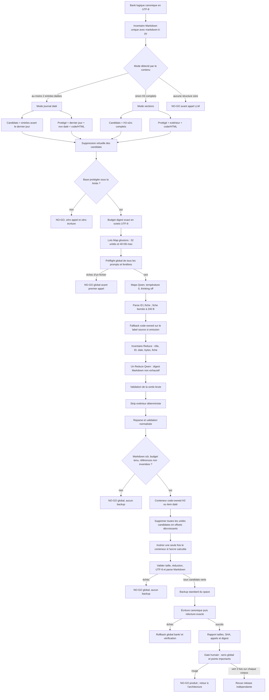

# Compactage hiérarchique Map/Reduce — Live Memory 2.8.0

**Status: final R&D NO-GO — not released or deployed**

Ce document est la spécification canonique du compacteur 2.8.0. Le nom du
fichier est conservé pour la traçabilité des travaux extractifs qui ont conduit
au design actuel. L'algorithme livré est désormais **hiérarchique et
abstractive** : le code inventorie des unités Markdown exactes, Qwen produit des
fiches temporaires puis un digest Markdown, et le code remplace l'historique
sélectionnable par un seul conteneur borné.

Ce statut n'autorise ni merge, bump, tag, release, canari ou production. Les
preuves de l'ancien algorithme extractif sont historiques : ses garanties
mécaniques restent utiles, mais son gate sémantique a échoué.

## 1. Décision produit

La compaction réduit volontairement l'information. Un résumé fidèle n'est pas
un inventaire exhaustif : il conserve le sens global et les points importants,
notamment les décisions, incidents, résolutions, risques ouverts, actions
requises et invariants durables. Il peut supprimer les répétitions, chroniques
de revue, états intermédiaires remplacés et détails d'exécution sans valeur
future.

Le contrat 2.8.0 est donc :

- le code choisit des unités Markdown anciennes et compressibles ;
- les Maps caractérisent localement toutes les unités, sans décider du texte
  persisté ;
- un unique Reduce produit le digest final à partir des fiches courtes ;
- le code valide ce digest, supprime toutes les unités historiques candidates
  et insère un seul conteneur de synthèse ;
- contenu récent, non daté, code, HTML, extérieur et fichiers non ciblés restent
  byte-identiques ;
- tous les candidats sont validés en mémoire avant backup et écriture ;
- aucune sortie partielle, aucun retry, aucun second modèle et aucun second
  algorithme.

Le LLM est autorité de synthèse, pas autorité structurelle : il ne choisit ni
offset, ni fichier, ni heading conteneur, ni opération de persistance. La
fidélité sémantique ne peut pas être prouvée par un set d'ancres ; elle est un
gate humain obligatoire sur les vraies banques.

## 2. Vue d'ensemble détaillée

## 3. Spécification normative de l'algorithme

### A. Inventaire logique et exactitude des octets

1. Construire l'inventaire des fichiers logiques. Une famille legacy
   `*.part-NNN.md` cohérente est réassemblée en mémoire ; une famille incomplète
   ou contradictoire arrête le job.
2. Encoder le contenu canonique en UTF-8 et le décoder strictement. Ne jamais
   normaliser BOM, CRLF/LF ou caractères multioctets.
3. Utiliser une seule vue Markdown, `markdown-it-py`, tables activées. Convertir
   ses positions de lignes en offsets d'octets dans le buffer original.
4. Définir une unité indivisible comme :
   - une section H3, du heading au prochain H1, H2 ou H3 ;
   - ou un item de liste de premier niveau avec son contenu.
5. Ne jamais extraire comme seconde unité un item déjà inclus dans un H3.
6. Reconnaître une date uniquement dans le label structurel, au format ISO
   `aaaa-mm-jj` ou français complet `jj/mm/aaaa`. Une date du corps n'a aucun
   effet sur le mode.
7. Vérifier l'absence de chevauchement et l'égalité exacte entre chaque slice
   `original[start_byte:end_byte]` et les octets mémorisés.

### B. Détection générique et protections

1. Si au moins deux H3 sont datés, utiliser ces H3 et les items de premier
   niveau extérieurs aux H3. Sinon, si au moins deux items sont datés, utiliser
   ces items. Ce choix établit le mode `dated` sans dépendre du nom du fichier.
2. En mode daté, rendre candidates uniquement les unités datées antérieures au
   dernier jour présent. Protéger le dernier jour, les unités sans date et toute
   unité contenant `fence`, `code_block`, `html_block` ou `html_inline`.
3. Sans journal daté, utiliser les H3 complets sûrs en mode `sections`. Refuser
   un fichier sans structure complète exploitable.
4. Construire la base immuable en supprimant virtuellement toutes les unités
   candidates. Tout octet hors candidat est protégé par construction.
5. Calculer `available = BANK_FILE_MAX_SIZE - bytes(base)`. Refuser si
   `available <= 0`.
6. Réserver 25 % de `available` à la croissance future en mode daté : le budget
   du conteneur vaut `floor(available × 3/4)`. En mode sections, il vaut
   `available`. Avant le Reduce, soustraire le wrapper code-owned minimal exact.
   Ce plafond brut est exact pour une sortie monoligne. Une sortie multiligne
   ajoute quatre octets d'indentation par ligne ; le code contrôle donc aussi la
   taille exacte du conteneur rendu et rejette tout dépassement, sans retry.

### C. Préflight global

1. Trier candidats et contexte protégé par offset source.
2. Former des lots gloutons d'au plus 32 unités et 40 000 octets. Refuser une
   unité indivisible dépassant 40 000 octets.
3. Construire tous les prompts Map et, pour chaque fichier, un prompt Reduce de
   pire cas avec une fiche de 240 octets par unité.
4. Vérifier avant tout appel que chaque prompt et son plafond de sortie tiennent
   dans la fenêtre configurée, et que la configuration autorise au moins 4 000
   tokens Map.
5. Fixer `planned_llm_calls = nombre de Maps + 1 Reduce` par fichier. L'échec du
   préflight d'un seul fichier produit zéro appel pour tout le job.

### D. Maps : caractérisation locale

1. Envoyer les unités source exactes, chacune entre marqueurs avec ID, date et
   taille, comme données non fiables.
2. Utiliser le modèle configuré, qualifié avec `qwen3.6:35b`, température zéro,
   thinking désactivé, plafond 4 000 tokens et aucun retry.
3. Demander une ligne `ID | fiche` par unité. La fiche décrit valeur future,
   état final ou intermédiaire, décision, risque, résolution et action utile.
4. Accepter une ligne portant un seul ID connu, même si ce même ID est répété.
   Ignorer une ligne avec zéro ID, plusieurs IDs distincts, un ID inconnu ou un
   doublon déjà accepté.
5. Normaliser les espaces et borner chaque fiche à 240 octets UTF-8.
6. Pour toute omission, fabriquer une fiche depuis la première ligne source non
   vide, avec la même borne. La sortie invalide du modèle n'est jamais réutilisée.
7. Les fiches sont éphémères : elles ne figurent ni dans la Bank, ni dans les
   rapports, ni dans les logs.

### E. Reduce : synthèse globale

1. Appeler exactement un Reduce par fichier, avec le plafond dynamique vérifié
   au préflight et borné à 6 000 octets de digest, sans retry.
2. Lui transmettre uniquement, pour chaque unité, le rôle `selectable` ou
   `protected`, l'ID, la date, la taille et la fiche Map. Le texte source complet
   n'est pas relu par le Reduce.
3. Le contexte `protected` sert uniquement à détecter les états remplacés. Il
   ne doit ni être résumé ni répété.
4. En mode daté, conserver uniquement les causes et mitigations durables,
   décisions, invariants, risques structurels et leçons encore applicables.
   Exclure états successifs, jalons, actions, métriques et chroniques de revue ;
   les zones récentes/protégées exactes restent l'autorité sur l'état courant.
5. En mode sections, prioriser mécanismes, invariants, décisions d'architecture
   et risques structurels durables.
6. Demander un digest Markdown non exhaustif de douze puces maximum.
   L'historique ne détermine aucun statut courant : il conserve seulement les
   faits encore applicables, décisions, invariants, risques structurels et
   leçons durables. Les statuts de PR/issues, chroniques de releases/revues,
   prochaines actions et décomptes de tests restent exclus ; les zones
   récentes/protégées exactes en sont l'autorité. Le code inline est autorisé.
   Les headings produits
   sont acceptés uniquement s'ils restent imbriqués dans l'item code-owned
   après rendu. Tables, liens, images, fences, blocs de code, HTML, blockquotes,
   séparateurs et JSON restent interdits.
7. Interdire les IDs internes U/P. Une référence `#N`, une version `vX.Y[.Z]`
   ou une date ISO/française ne peut apparaître que si elle existe déjà dans le
   fichier source.
8. Le modèle peut laisser du budget inutilisé. Si sa sortie complète et valide
   dépasse le budget, couper sa queue au dernier mot qui tient, ajouter une
   ellipse et revalider ; l'ordre demandé place les points prioritaires en tête.
   Aucun retry n'est effectué.
9. Réserver avant cette coupe quatre octets par retour à la ligne du digest,
   correspondant à son indentation exacte dans le conteneur Markdown.

### F. Validation du digest

1. Valider la sortie brute complète avant toute normalisation.
2. Retirer uniquement les espaces extérieurs avec `strip`, puis reparser et
   revalider la sortie normalisée. Une structure cachée par les bords ne peut
   ainsi devenir active après validation.
3. Parser chaque fois le digest dans l'environnement de références Markdown de
   la base conservée. Une définition de lien dans le digest ne peut donc pas
   activer le contenu protégé, et une définition protégée ne peut pas activer un
   lien ajouté par le digest.
4. Rejeter sortie vide ou sans token visible, définition de lien, JSON complet,
   token interdit, racine autre que paragraphe/liste/heading, puis retirer les
   ID internes Map/Reduce et les références absentes de la source avant une
   seconde validation Markdown, puis appliquer le budget UTF-8.
5. Ne pas exiger la conservation de toutes les références : le digest est
   volontairement non exhaustif. L'invariant est absence d'invention, pas
   exhaustivité.

### G. Conteneur recompactable et cycle de vie

1. Choisir comme ancre le premier H3 candidat s'il existe, sinon le premier item
   candidat. Calculer son offset après suppression des unités précédentes.
2. La date du conteneur en mode daté est la date maximale des unités candidates.
3. Si l'ancre est H3, rendre un heading `Historique compacté`, suivi d'un unique
   item `Synthèse non exhaustive` contenant le digest indenté.
4. Si l'ancre est un item, rendre un unique item daté `Historique compacté
   (synthèse non exhaustive)` contenant le digest indenté.
5. Indenter chaque ligne du digest de quatre espaces sous l'unique item externe.
   Les puces datées du digest ne deviennent donc jamais des unités de premier
   niveau lors d'une passe suivante.
6. Après rendu, comparer les headings racine H1 à H6 du conteneur avec ceux du
   wrapper vide code-owned. Tout heading généré qui s'échappe au niveau racine
   fait rejeter le candidat. L'inventaire ne considère comme frontières que les
   headings H1 à H3 de niveau racine ; les headings imbriqués restent dans
   l'unité conteneur.
7. Le conteneur est volontairement une unité candidate normale. Une future
   compaction le **remplace** ; elle ne l'imbrique et ne l'accumule jamais.
8. En mode mixte liste/H3, l'ancre H3 est prioritaire afin que la passe suivante
   conserve le même mode. Le dernier jour et les unités protégées restent exacts.

### H. Construction atomique

1. Partir des octets originaux et supprimer toutes les unités candidates, en
   offsets décroissants, après revérification de chaque slice.
2. Insérer une seule fois le conteneur à l'offset calculé.
3. Exiger que le conteneur tienne dans son allocation, que le candidat soit
   strictement plus petit, sous la limite et décodable/parserable en UTF-8
   Markdown.
4. Préparer ainsi tous les fichiers en mémoire. Un seul échec annule le job avant
   backup.
5. Créer le backup standard du space, écrire chaque fichier sous son nom
   canonique, relire et vérifier les octets, puis supprimer les parts legacy.
6. Au premier échec de persistance, restaurer et vérifier globalement `bank/`
   depuis le backup. Ne pas restaurer le space entier, afin de préserver les
   notes live éventuellement créées concurremment.
7. Une auto-compaction échouée bloque la consolidation suivante : aucune note
   live n'est consommée contre une Bank non maîtrisée.

### I. Observabilité et invocation

- `dry_run=true` inventorie tailles, familles et appels prévus ; aucun LLM,
  backup ou write.
- `dry_run=false` enfile le job dans la FIFO existante du space et retourne son
  `job_id`.
- La permission `manage` est requise et le verrou par space est partagé avec la
  consolidation.
- Le rapport expose modèle, `finish_reason`, appels planifiés/tentés, lots Map,
  fiches valides/fallbacks, mode, candidats/protégés, `digest_bytes`,
  `digest_container_bytes`, `digest_budget_bytes`,
  `digest_container_budget_bytes`, tailles et SHA avant/après,
  cible et backup. Aucun prompt, fiche ou raw LLM.
- En cas d'annulation multi-fichiers, seul le fichier réellement fautif porte
  son erreur et ses tailles digest ; les autres sont explicitement marqués
  annulés par cet échec.
- Le plafond de sortie Reduce vaut `min(max_tokens configuré, budget brut du
  digest)` ; cette valeur exacte est vérifiée au préflight puis réutilisée pour
  l'appel, sans réduction silencieuse ni retry.

## 4. Invariants testés

Les tests utiles couvrent uniquement les chemins qui peuvent corrompre l'état
ou invalider le contrat :

- offsets UTF-8, CRLF, BOM, limites H1/H2/H3 et unités indivisibles ;
- détection générique datée/sections et protection du dernier jour, non daté,
  fences et HTML ;
- batches bornés, unité trop grosse, fenêtre de contexte et préflight global ;
- parsing Map hostile, ambigu, inconnu, dupliqué, omis et fallback borné ;
- digest vide, tronqué, hors budget, JSON, structure interdite, ID interne ou
  référence inventée ;
- code inline légitime et références source légitimes ;
- ancre H3/list, mode mixte et remplacement du digest lors d'une seconde passe ;
- candidat sous limite, extérieur/protégé exact et absence d'écriture avant la
  validation de tous les fichiers ;
- backup avant mutation, relecture, rollback multi-fichiers et blocage de la
  consolidation automatique en cas d'échec.

Les mocks valident la plomberie et les invariants, jamais la qualité métier. Le
gate sémantique s'effectue exclusivement avec `qwen3.6:35b` sur les vraies
banques restaurées localement.

## 5. Gates 2.8.0

Le pivot abstractive remet les compteurs de validation à zéro. Avant merge,
bump ou release :

1. suite unitaire complète, lint et diff-check verts ;
2. trois restaurations et exécutions Docker consécutives sur `mcp-agent` ;
3. trois restaurations et exécutions Docker consécutives sur `agentic-platform` ;
4. à chaque passe : résultat sous limite, aucun fichier en échec, récent,
   protégé, extérieur et fichiers non ciblés byte-identiques, backup et rollback
   vérifiés ;
5. revue humaine du sens global et des points importants ;
6. revue adverse indépendante favorable ;
7. recette Docker locale complète puis revue release distincte.

L'auto-compaction production reste gelée jusqu'à un canari manuel explicitement
autorisé et validé. Un GO de code n'autorise pas un run réel ; un GO de run
n'autorise pas merge, release ou production.

## 6. Résultats expérimentaux ayant conduit au pivot

### Extractif hiérarchique : mécanique verte, sémantique rouge

Le job réel `compact_c91baa...` sur `mcp-agent` a produit :

- `progress.md` : 120 534 → 28 177 octets ;
- `systemPatterns.md` : 37 133 → 33 931 octets ;
- 12 appels Qwen, aucun octet généré persisté.

Le candidat était exact mais déséquilibré : 31 unités contiguës U0035–U0065,
dont 19 consacrées aux mêmes chaînes de revue #106/#111, ont consommé le budget
tandis que des incidents et décisions transverses disparaissaient. Le gate
humain a conclu NO-GO. Cette preuve établit que **sélectionner des unités source
entières ne suffit pas à compacter le sens** : les répétitions doivent être
fusionnées, ce qui exige une synthèse abstractive.

Les recettes extractives antérieures sur `agentic-platform` restent des preuves
de robustesse des offsets, protections, préflight et transaction. Elles ne
valident pas le digest 2.8.0 et ne comptent pas dans les trois passes requises.

### Premier run abstractive : transaction verte, budget rouge

Le job `compact_30d58505613f41d4aaeca3f8b130f5a8` sur la copie S3 DEV de
`mcp-agent` a exécuté les 12 appels prévus. Le candidat `progress.md` a été
préparé en mémoire, puis `systemPatterns.md` a dépassé le plafond brut obtenu
par la division conservatrice par cinq. Le job global a été annulé avant backup
et écriture. La capture S3 après échec est strictement identique au manifeste
avant exécution : 29 objets, 225 619 octets, SHA-256 d'arbre
`9a63e0f8ce763d606b166d04bd5cf0999a8b3bca659b003f2c172e1d20feaaed`.

Ce run valide le fail-closed, pas la qualité du digest. La correction supprime
la division par cinq et réserve seulement le wrapper minimal exact ; le rendu
final reste contrôlé en octets, notamment pour l'indentation multiligne. Les
compteurs de gates réussis restent donc à zéro.

Le run corrigé suivant, `compact_629c7c234b314793b03553ee4de5b8e9`,
confirme le budget (`5 747 < 20 317` octets) mais rejette `progress.md` parce
que Qwen produit un heading. `systemPatterns.md` est annulé avant appel et le
manifeste S3 reste identique. Ce heading n'est pas une invention de fait ni une
menace lorsqu'il reste imbriqué dans le conteneur ; le contrat est donc amendé
avec la garde structurelle décrite en G, sans retry ni assouplissement des
autres tokens interdits. Les compteurs de gates réussis restent à zéro.

### Gate final Map/Reduce : mécanique verte, sémantique rouge

Les recettes Docker finales sur les sources réelles restaurées ont validé la
mécanique complète :

- `mcp-agent/progress.md` : 120 534 → 10 523 octets ;
- `mcp-agent/systemPatterns.md` : 37 133 → 33 022 octets ;
- `agentic-platform/progress.md` : 195 489 → 5 942 octets ;
- 12 puis 7 appels Qwen, `finish_reason=stop`, backup, écriture et relecture
  vérifiés, aucune mutation partielle.

Le gate sémantique reste rouge. Les sorties ont notamment inversé un ordre de
déploiement Mission/Vault, conservé un état de révocation admin remplacé,
généralisé à tort une règle zéro-retry et déformé le mécanisme de scrubbing des
secrets. Une règle de récence a corrigé l'ordre de déploiement lors du dernier
rejeu, mais pas les autres contresens. Conformément au coupe-circuit, aucun
nouveau prompt, algorithme ou run n'est ajouté à cette variante.

Les deux espaces S3 DEV ont été restaurés à leurs snapshots source exacts après
les essais. Aucun changement de production, bump, tag ou release 2.8.0 n'a été
effectué. La 2.7.3 reste le contrat produit.

## 7. Fondements dans la littérature

La littérature guide l'architecture ; elle ne remplace ni les tests réels ni la
revue humaine.

- **Split puis synthèse globale — SummN.** Les longs documents sont segmentés,
  résumés localement puis agrégés. Live Memory retient deux niveaux fixes :
  Maps bornées et un Reduce, sans cascade ni état intermédiaire persisté.
  Zhang et al., ACL 2022 : <https://aclanthology.org/2022.acl-long.112/>.
- **Structure du document — HIBRIDS.** Les headings et sections portent une
  information utile pour la synthèse. Ici, aucune architecture entraînée : les
  frontières Markdown définissent directement des unités indivisibles.
  Cao et Wang, ACL 2022 : <https://aclanthology.org/2022.acl-long.58/>.
- **Biais de position — Lost in the Middle.** Une information noyée dans un
  long contexte est moins bien utilisée. Les Maps donnent à chaque unité une
  caractérisation locale ; le Reduce voit des fiches homogènes plutôt qu'un
  journal monolithique. Liu et al., TACL 2024 :
  <https://aclanthology.org/2024.tacl-1.9/>.
- **Extract-then-abstract.** Une sélection ou caractérisation préalable peut
  améliorer la fidélité d'une synthèse générative. Nos Maps jouent ce rôle sans
  ajouter un second modèle ni une phase de persistance. Zhang et al., Findings
  EMNLP 2023 : <https://aclanthology.org/2023.findings-emnlp.214/>.
- **Abstraction et fidélité.** Une synthèse plus abstractive fusionne mieux les
  répétitions mais augmente le risque d'altération. Cela justifie l'absence de
  retry/réparation, le contrôle des références inventées et le gate humain.
  Ladhak et al., ACL 2022 : <https://aclanthology.org/2022.acl-long.100/>.
- **Extraction n'est pas fidélité.** Des extraits exacts peuvent rester
  trompeurs par contexte incomplet ou coréférence. L'échec extractif réel de
  `mcp-agent` confirme cette limite : exactitude des octets et préservation du
  sens sont deux propriétés distinctes. Zhang et al., ACL 2023 :
  <https://aclanthology.org/2023.acl-long.120/>.
- **Compression de contexte — RECOMP.** La compression extractive ou abstractive
  réduit le coût du contexte. Live Memory n'en reprend que le principe de
  compression bornée ; aucun RAG, entraînement, vector store ou augmentation
  sélective. Xu et al., ICLR 2024 :
  <https://proceedings.iclr.cc/paper_files/paper/2024/hash/bda88ed2892f5e61c9a9bf215c566913-Abstract-Conference.html>.

### Conséquences architecturales

Ces travaux et les recettes conduisent à six choix sobres : unités Markdown
complètes, Maps locales bornées, un seul Reduce global, digest généré sous garde
du code, protections byte-exactes et validation humaine réelle. Sont écartés :
requête monolithique, archive hot/cold, RAG/Graph, éditeur Markdown générique,
constrained decoding, modèle entraîné, métrique automatique déclarée juge de
fidélité, retry, fallback modèle et cascade multi-étages.

## 8. Non-objectifs 2.8.0

- conserver chaque détail ou chaque référence de l'historique ;
- archive hot/cold, recherche, RAG ou Graph Memory ;
- second compacteur, modèle de secours, retry ou option de stratégie ;
- rôles ou configuration par nom de fichier ;
- éditeur Markdown générique ou plan JSON LLM ;
- changement de S3, backup, rollback, queue ou FIFO ;
- activation automatique en production avant canari manuel validé.
