# Compactage extractif générique — Live Memory 2.8.0

**Statut : première recette générique NO-GO métier — production gelée**

## Décision

Le compacteur ne connaît aucun nom ni rôle de fichier. Il travaille sur
l'inventaire logique canonique de la Memory Bank déjà construit par le serveur.
Chaque fichier Markdown logique qui dépasse `BANK_FILE_MAX_SIZE` est analysé à
partir de sa structure et de son contenu.

Qwen 35B ne génère jamais le Markdown persisté. Il classe uniquement des IDs
d'unités Markdown complètes. Le serveur conserve les unités retenues dans leurs
octets source exacts et supprime les autres. La fidélité recherchée est donc la
préservation du sens global et des points importants, pas l'exhaustivité de
l'historique ni de ses répétitions.

Les noms tels que `progress.md` ou `systemPatterns.md` n'apparaissent que dans
les fixtures de recette. Ils ne déclenchent aucun comportement particulier.

## Algorithme unique

```mermaid
flowchart LR
    A["Inventaire logique canonique de la Bank"] --> B["Fichiers au-dessus de la limite"]
    B --> C["Détection du mode par structure et contenu"]
    C --> D["Préflight de tous les fichiers et prompts"]
    D --> E["Un classement Qwen par fichier compressible"]
    E --> F["Candidats exacts tous validés en mémoire"]
    F --> G["Backup global"]
    G --> H["Écritures canoniques et relecture"]
    H --> I["Rollback global au moindre échec"]
```

### 1. Inventaire

- Le serveur utilise uniquement les fichiers logiques issus de son inventaire
  canonique, y compris les familles legacy réassemblées en mémoire.
- Il ne parcourt pas directement les objets S3 pour découvrir des candidats.
- Les limites et tailles sont mesurées en octets UTF-8.
- `markdown-it-py` fournit l'unique vue Markdown.

### 2. Détection du mode

Le mode est déterminé indépendamment pour chaque fichier surdimensionné :

- **Mode daté** : le fichier contient au moins deux unités structurelles de même
  nature dont le label porte une date complète ISO ou `jj/mm/aaaa`. Les dates
  citées dans le corps ne comptent pas. Les H3 datés sont prioritaires ; à
  défaut, les items de liste de premier niveau datés sont utilisés, y compris
  sous un H3 conteneur non daté. Les deux représentations ne sont jamais
  mélangées. Seules les unités antérieures au dernier jour sont candidates ; le
  dernier jour et les unités non datées restent protégés.
- **Mode sections** : en l'absence de journal daté identifiable, les sections H3
  complètes sont candidates. Une section va de son H3 au prochain H1, H2 ou H3.
- **Échec fermé** : sans journal daté identifiable ni section H3 complète, le
  fichier n'est pas compactable et le job entier s'arrête avant tout appel LLM.

Le seuil de deux dates évite qu'une date incidente transforme un document
thématique en journal. Une fois le mode daté choisi, le compacteur ne réutilise
pas les H3 non datés comme candidats dans le même job.

### 3. Contenu protégé

Une unité contenant une fence, un bloc de code indenté ou du HTML brut/inline
est entièrement protégée. Le préambule, les séparateurs, le contenu récent ou
non daté et toutes les zones extérieures aux unités candidates restent
byte-identiques.

Le prompt d'un fichier inclut ses propres unités protégées comme contexte non
sélectionnable. Aucun autre fichier n'est utilisé comme autorité : le résultat
d'un fichier doit être défendable par son contenu seul.

### 4. Classement et rendu

- Une requête Qwen maximum par fichier surdimensionné et compressible.
- Qwen reçoit les unités candidates identifiées et le contexte protégé du même
  fichier ; il retourne seulement un ordre d'IDs.
- Les IDs inconnus et doublons sont ignorés, mais au moins un ID connu est
  obligatoire.
- Le code retient gloutonnement des unités entières jusqu'au budget disponible,
  puis les rend dans leur ordre documentaire en supprimant seulement les unités
  anciennes non retenues.
- En mode daté, 75 % de la place restant après le contenu protégé est allouée aux
  unités anciennes afin de conserver une marge de croissance. En mode sections,
  toute la place disponible est utilisable.
- Le candidat doit être strictement plus petit que l'original et ne pas dépasser
  `BANK_FILE_MAX_SIZE`.

Il n'existe ni résumé génératif persisté, ni reconstruction de headings, ni
éditeur Markdown, ni second algorithme.

## Transaction et coupe-circuit

L'ordre est obligatoire :

1. inventorier tous les fichiers logiques ;
2. préflighter tous les fichiers surdimensionnés, leurs budgets, prompts et
   fenêtres de contexte avant le premier appel Qwen ;
3. obtenir au plus un classement par fichier ;
4. construire et valider tous les candidats en mémoire ;
5. créer le backup global ;
6. écrire, relire et vérifier les fichiers canoniques ;
7. restaurer et vérifier tout `bank/` au moindre échec de persistance.

Un échec de préflight, de classement ou de candidat produit zéro backup et zéro
écriture. Un échec d'auto-compaction bloque la consolidation suivante : aucune
note live n'est consommée. Les mécanismes éprouvés de la 2.7.3 restent les seuls
mécanismes de persistance : backup, rollback, écriture canonique et FIFO par
espace.

Après un préflight réussi, les rapports exposent `planned_llm_calls`, égal au
nombre de fichiers logiques surdimensionnés et compressibles. Un préflight
rejeté rapporte zéro appel planifié et provoque effectivement zéro appel. Il
n'existe pas de plafond global arbitraire. Une famille legacy déjà sous la
limite est réassemblée byte-exactement sans appel Qwen.

## Contrat LLM

- modèle configuré, qualifié avec `qwen3.6:35b` ;
- température zéro et thinking désactivé ;
- maximum 2 000 tokens de sortie ;
- sortie utilisée uniquement comme classement d'IDs ;
- contexte limité au fichier traité ;
- aucun retry, modèle secondaire, JSON d'édition ou prose persistée.

## Gates de validation

Le changement d'une architecture liée à trois noms de fichiers vers ce contrat
générique invalide le précédent gate produit. La branche peut être poussée et
une Draft PR peut être ouverte uniquement comme véhicule de revue, avec le
statut `NO-GO / DO NOT MERGE`. Avant tout merge, bump ou release, il faut :

1. une suite unitaire complète verte, avec notamment le même contenu sous deux
   noms arbitraires produisant le même plan ;
2. trois restaurations et exécutions Docker consécutives sur la fixture réelle
   `mcp-agent` ;
3. trois restaurations et exécutions Docker consécutives sur la fixture réelle
   `agentic-platform`, représentative des gros fichiers ;
4. pour chaque passe : taille finale conforme, contenu protégé et extérieur
   byte-identique, aucun fichier en échec, backup avant écriture et rollback
   vérifié par mutation ;
5. revue humaine du sens global et des points importants conservés ;
6. revue adverse indépendante favorable.

Les résultats obtenus avec l'ancienne sélection par noms restent une preuve
historique de faisabilité extractive et transactionnelle, mais ne valident pas
ce contrat générique. La production et l'auto-compaction restent gelées jusqu'au
canari manuel convenu.

### Recette générique du 15 août 2026 — NO-GO

Un backup frais du space distant `agentic-platform` a été restauré byte-exactement
dans le bucket DEV utilisé par le Docker local. Le run réel
`compact_14bda21a71e041d884770ee47dbd5efd` a traité le seul fichier
surdimensionné avec le vrai `qwen3.6:35b` :

- `progress.md` : 195 489 → 26 906 octets, sous la limite de 35 000 ;
- un appel Qwen, `finish_reason=stop`, aucun retry ;
- 170 unités éligibles, 21 retenues, 3 protégées ;
- 6/6 autres fichiers byte-identiques ;
- candidat indépendamment reconstruit par suppression d'unités entières
  uniquement ; contenu protégé exact ;
- backup transactionnel créé avant l'écriture.

Le gate humain est toutefois rouge. Dix-sept des 21 unités retenues, soit
81,6 % des octets sélectionnés, décrivent une même chaîne de canaris des 3 au
6 août. Des résolutions et faits plus récents disparaissent, notamment le
vecteur d'exposition de `BROKER_SIGNING_ENC_KEY` via `show-mcp-env.py` et la fin
de migration, tandis que plusieurs blocages intermédiaires déjà résolus restent
surreprésentés.

Conclusion : cette recette valide l'intégrité, le coût et la transaction, mais
invalide le classement global direct comme arbitre de la valeur future sur un
gros journal. Seuls le push de la branche et une Draft PR de revue explicitement
`NO-GO / DO NOT MERGE` sont autorisés. Aucun merge, second run, bump, release,
canari ou déploiement production n'est autorisé avec cet algorithme inchangé.

## Non-objectifs 2.8.0

- archive hot/cold, RAG, Graph Memory ou recherche sémantique ;
- résumé génératif persisté ;
- second compacteur, modèle de secours, retry ou option de stratégie ;
- rôles ou configuration par nom de fichier ;
- éditeur Markdown générique ;
- changement du backup, du stockage S3, de la queue ou de la FIFO ;
- activation automatique en production avant un canari manuel validé.

## Références de recherche

- Ladhak et al., *Faithful or Extractive?*, ACL 2022 :
  <https://aclanthology.org/2022.acl-long.100/>
- Zhang et al., *Extractive is not Faithful*, ACL 2023 :
  <https://aclanthology.org/2023.acl-long.120/>
- Liu et al., *Lost in the Middle*, TACL 2024 :
  <https://arxiv.org/abs/2307.03172>
- Xu et al., *RECOMP*, ICLR 2024 :
  <https://openreview.net/forum?id=mlJLVigNHp>
